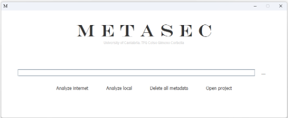
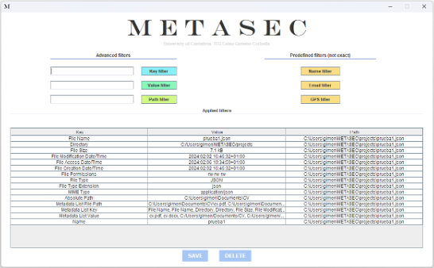

# MetaSec
Aplicación para el análisis y borrado de metadatos

Los archivos que manejamos tienen asociados metadatos que pueden estar relacionados con información sensible (como la ubicación, fecha de creación, autor, etc.). Por lo tanto, es crucial ser consciente de estos datos ocultos y limpiarlos de los archivos antes de compartirlos.

MetaSec es una herramienta que permite a los usuarios:
- Cargar un conjunto de ficheros desde una carpeta local o una URL.
- Extraer los metadatos de dichos ficheros.
- Ofrecer la opción de guardar y cargar la sesión de análisis con los metadatos extraídos.
- Presentar la información de forma que el usuario pueda consultarla utilizando distintos filtros (por ejemplo, ver los metadatos asociados a un fichero, ver todos los metadatos que indican direcciones de correo, etc.).
- Ofrecer la posibilidad de eliminar los metadatos asociados.

